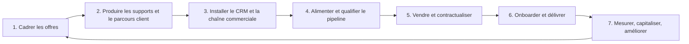

# Plan d’exécution — système d’offres et de vente MolenGeek Roubaix

**Objectif commercial :** 10 000 € HT encaissés à la commande sur la première campagne.  
**Principe :** chaque offre est vendable, délivrable, suivie et améliorable de cohorte en cohorte.

## 1. Chaîne de travail et dépendances

| Étape | Dépend de | Action | Sortie obligatoire |
|---|---|---|---|
| 1. Cadrer | brief + méthode Hormozi | construire puis valider avatar, dream outcome, frictions, solutions, offre-stack, prix, périmètre, prérequis, capacité, responsable et exclusions | fiche d’offre interne validée |
| 2. Produire | 1 | créer les supports de vente et les premiers supports bénéficiaires | kit commercial + kit d’onboarding |
| 3. Installer | 1 et 2 | CRM, agenda, paiement, contrats, modèle de dossier client BDD/espace sécurisé, passations | pipeline testé de bout en bout |
| 4. Alimenter | 3 | listes, prospection, qualification et rendez-vous | rendez-vous qualifiés documentés |
| 5. Vendre | 4 | diagnostic, proposition, paiement, contrat | vente gagnée ou perte codifiée |
| 6. Délivrer | 5 | onboarding, accompagnement, livrables, satisfaction | livrables acceptés, retours recueillis |
| 7. Améliorer | 6 | analyser ventes, objections, marge, capacité et satisfaction ; versionner les ressources | offre améliorée avant prochaine cohorte |

## 2. Équipe commerciale en chaîne

| Rôle | Responsabilité | Sortie / passation |
|---|---|---|
| Pilotage commercial | objectifs, prix, capacité et arbitrages | priorités et décisions consignées |
| Recherche et enrichissement | identifier les TPE, signaux, contacts et score | prospect prêt à contacter |
| Prospection | terrain, réseaux, DM, appels et relances initiales | intérêt, hypothèse de problème, rendez-vous ou relance datée |
| Qualification / diagnostic | urgence, décisionnaire, besoin, adéquation | résumé du besoin + offre recommandée ou disqualification |
| Proposition / conclusion | périmètre, contrat, paiement, objections | commande encaissée ou perte codifiée |
| Onboarding / customer success | dossier BDD, prérequis, parcours, premier jalon | dossier prêt à délivrer |
| Opérations / delivery | experts, livrables, risques, qualité | livraison, satisfaction, preuve autorisée |

- Aucun rendez-vous n’est transmis sans contact, signal, hypothèse de problème et prochaine action.
- Aucun diagnostic ne passe à la vente sans résumé, décisionnaire et offre recommandée.
- Aucune vente ne passe en delivery sans paiement, périmètre, prérequis et responsable confirmé.

## 3. Cadrer avant de créer les produits

**Ne créer aucun dossier d’offre ni arborescence produit avant la validation de l’étape 1.** Les offres du brief sont des hypothèses.

Utiliser [la méthode Hormozi](../references/methode-offres-alex-hormozi.md) pour chaque combinaison segment × problème. Valider :

- client idéal et critères de non-éligibilité ;
- dream outcome et promesse en livrables observables ;
- parcours, frictions, peurs, objections et tâches ;
- solution à chaque friction, puis tri valeur/coût/difficulté ;
- offre-stack : noyau, preuve, accélérateurs, réduction d’effort, bonus, garantie/réversibilité, urgence/rareté réelles ;
- DIY/DWY/DFY, format, jalons, rôle client/MolenGeek ;
- prix, paiement, coûts tiers, données, sécurité, capacité et critères de succès.

## 4. Créer l’arborescence après validation

Après validation d’une offre, créer son dossier produit : `spec/`, `commercial/`, `onboarding/`, `contenu/tronc-commun/`, `contenu/cohortes/YYYY-MM-nom-cohorte/{sessions,livrables,ressources}/` et `operations/{automatisations,scripts-google,templates}/`.

Le suivi des bénéficiaires est en BDD/CRM, pas dans le dossier : identifiant client, cohorte, jalon, statut, prochaines actions, livrables, blocages, satisfaction et autorisations. Les contrats, diagnostics et coordonnées sont dans les espaces sécurisés.

## 5. Supports à produire après validation, avant diffusion large

| Catégorie | Support |
|---|---|
| Vente | fiche offre une page, page de vente, flyer catalogue, proposition/bon de commande, page preuves |
| Impact | page contribution suspendue, proposition mécène distincte |
| Onboarding | bienvenue, checklist client, formulaire de cadrage |
| Délivrance | activités, modèles, exercices, enregistrements, checklists et ressources versionnées par cohorte |

## 6. Parcours prospect → bénéficiaire

Pipeline : `à rechercher → enrichi → à contacter → contacté → intéressé → rendez-vous réservé → qualifié → proposition → négociation → gagné / perdu / liste d’attente`.

Le CRM contient : entreprise, contact, canal, situation, signal, problème, score /35, propriétaire, offre, étape, montants HT, contribution suspendue séparée, prochaine action, objection/motif de perte et consentement.

Dès la vente : contrat/bon, paiement, contacts autorisés, diagnostic final, périmètre, accès, calendrier, responsable et ressources de cohorte sont vérifiés. Le suivi conserve jalon, actions client/MolenGeek, blocage, prochain point, livrable, acceptation et satisfaction.

Le gratuit reste une voie séparée : inscription, consentement, coworking ouvert selon règles, événements et liste d’attente ; sans accompagnement premium implicite.

## 7. Outil futur de trames de prospection

Ranger les trames dans `outils/trames-prospection/` par canal, type de prospect, problème, objection et prochaine action. La page HTML future dérive de cette base : formulaire de scénario, trame recommandée, questions de diagnostic, prochaine action et mode entraînement. Pas de données sensibles dans cet outil ; le CRM est la source de vérité.

## 8. Pilotage, qualité et conformité

Suivre régulièrement : prospects, réponses, rendez-vous, propositions, conversion par passation, panier, encaissement, capacité, liste d’attente et objections. Modifier prix, promesse ou périmètre uniquement après validation de livraison.

- Pas de promesse de CA, subvention, OPCO ou place non financée.
- Klarna : possibilité soumise à acceptation ; conditions de paiement validées avant vente.
- Contribution suspendue/mécénat séparés de la prestation, sans promesse fiscale.
- Logos selon autorisations ; IA/OAuth/automatisations validés sur accès, sécurité, coûts et réversibilité.
- Les experts interviennent dans leur périmètre professionnel.
